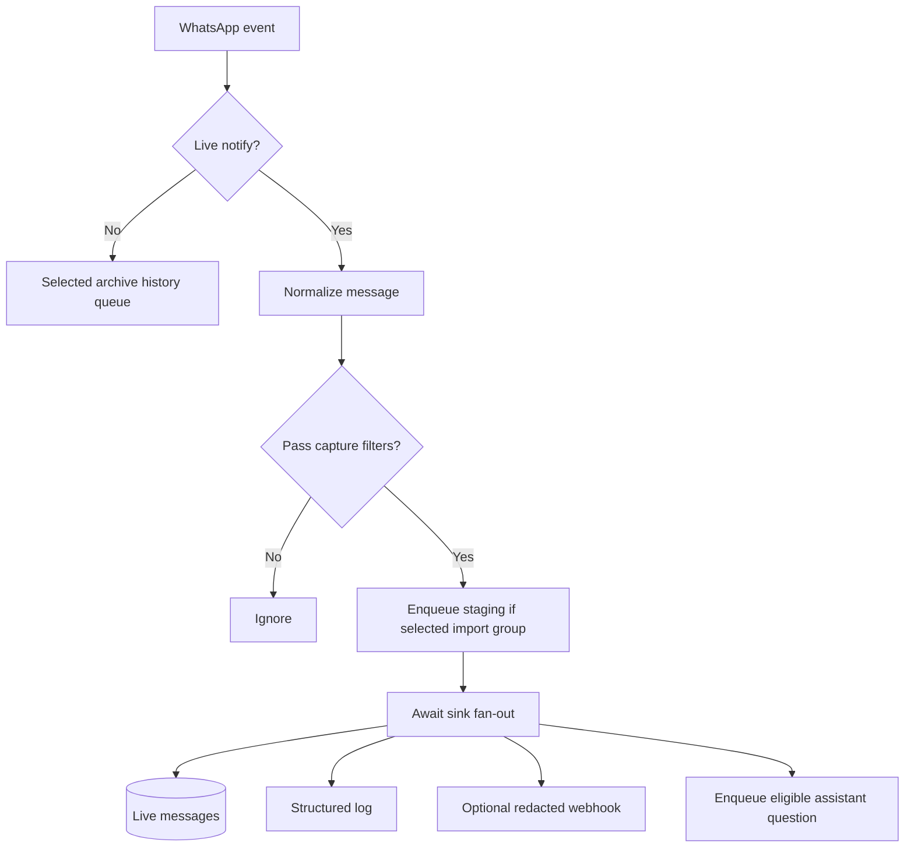
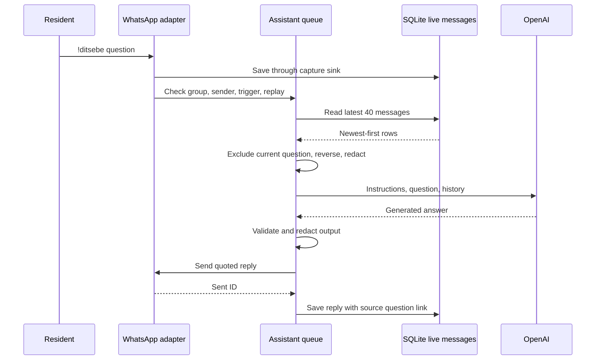
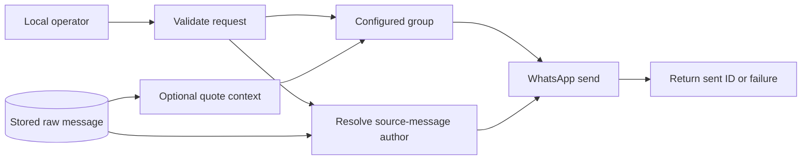
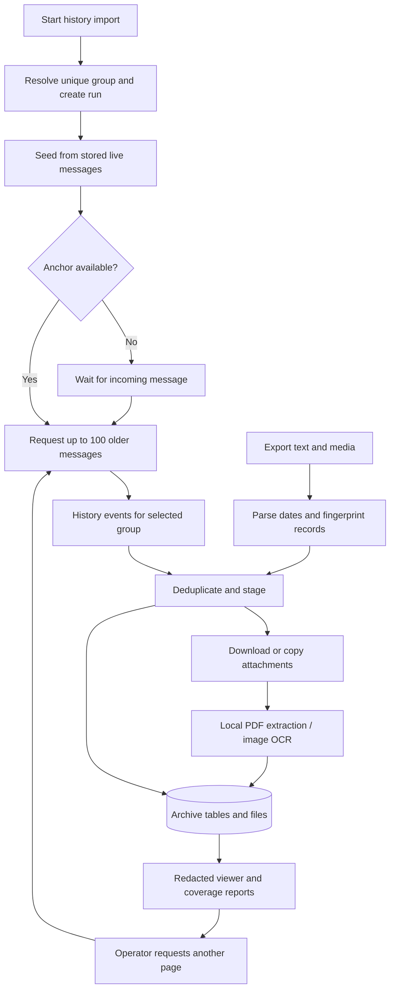

# Data flow

## Live capture



Normalization drops status broadcasts and protocol noise, extracts text/captions and quote IDs, and converts timestamps to milliseconds. Internal records contain `id`, `chatId`, `chatName`, `isGroup`, `senderId`, `senderName`, `fromMe`, `type`, `text`, `quotedMessageId`, `timestamp`, and `raw`.

`GROUPS_ONLY=true` excludes direct messages except incoming replies from recipients contacted through manual private sending in the current process. `CAPTURE_OWN=false` excludes linked-account messages. Sink handlers run concurrently with individual error handling; the callback awaits their completion before invoking the assistant.

The webhook receives a reduced payload, illustrated below. It excludes raw payloads and original chat/sender identifiers; an optional bearer token authenticates the POST.

```json
{
  "id": "example-message-id",
  "chat": "Group-a1b2c3d4e5f6",
  "sender": "Resident-123456abcdef",
  "text": "The water is back on.",
  "timestamp": 1789200000000,
  "type": "conversation"
}
```

## Group question and reply



Only incoming `!ditsebe` commands in `AGENT_GROUP_ID` qualify. A bare command returns usage text without a model call when the assistant is enabled. The assistant requires `LLM_ENABLED=true` and an API key.

Context is read when the queued job starts: up to 40 rows, excluding the current question, then reversed into chronological order. This may leave 39 rows and can include messages received while the question waited. Archive records and attachment extraction results are not included.

History text is capped at 2,000 characters per message and the question at 6,000. Sender labels are pseudonymous; phone/contact patterns are filtered. Timestamps, message IDs, and quote links accompany the text. The Responses request uses `store: false`, a 45-second timeout, zero SDK retries, and a 2,000-token output limit. This is request configuration, not a blanket provider-retention guarantee.

A completed, nonempty answer is capped at 10,000 characters and redacted before sending. The reply is saved directly even with own-message capture disabled. That direct save does not invoke webhook fan-out. Failures are logged by phase without stopping later jobs, and sends are not automatically retried.

## Manual sending



`POST /messages/send` sends to the configured group with optional quote context. `POST /messages/private` resolves `sourceMessageId` in that group's live store and derives the recipient from the original participant field. Neither route accepts an arbitrary destination.

Private sending registers the recipient in memory so subsequent incoming direct messages can pass the group-only capture filter until restart. These messages can be stored and webhooked but do not trigger the group assistant. Manual sends are not explicitly saved by the API; outgoing capture depends on adapter events and filters. A successful send response is not a recipient delivery receipt.

## Archive imports



History events only enter archive processing. Live messages for the selected group are also staged while continuing through normal capture. Import processing does not call the assistant, send replies, or invoke webhooks.

Continuation uses the oldest staged record with a usable WhatsApp key. Repeated anchors are suppressed in memory. After 45 seconds without a response, the run can report `no_history_received`; late history can still arrive. Coverage is always subject to review.

The export CLI preserves the original text, parses English Android/iOS formats with explicit `DMY` or `MDY` dates and UTC+02:00, and fingerprints messages for repeat-import deduplication. Exports do not preserve reliable reply IDs or own-message identity. Attachment paths must resolve inside the export directory.

Files are limited to 25 MB. Images use local English OCR. PDFs use text extraction with OCR for empty-text pages, up to 100 pages. OCR assets may download on first use. Statuses distinguish pending, downloaded, extracted, partial, missing, unsupported, and failed outcomes. Counts and extraction success do not prove complete coverage or accurate OCR.

Review annotations retain source messages. `useful` means worth retaining, not verified/current, and does not activate any workflow.

## Privacy boundaries

| Destination | Data |
| --- | --- |
| Local database/files | Original identifiers, text and raw payloads; imported media, extracted text, and pseudonym salt. |
| HTTP reads | Pseudonymous group/sender labels and filtered text. Raw payloads and attachments are not served. Group-send success still returns the actual destination chat ID. |
| OpenAI | Redacted question and recent live context, pseudonyms, timestamps, message IDs, and quote links. |
| Webhook | Reduced redacted live-message record shown above. |
| Logs | UTC time, event, safe counts/status/timing, and process-local anonymous references. No message bodies, raw payloads, exception text, or secrets. |
| WhatsApp outbound | Redacted generated answer or manually supplied text. Manual text is sent as supplied. |

Stable aliases use HMAC with a database-stored salt; log references use a separate per-process salt. Filtering targets phone-like values, WhatsApp identifiers, and contact links. Names in prose, addresses, OCR errors, and unusual formats can remain identifying. Redaction does not encrypt stored originals.
