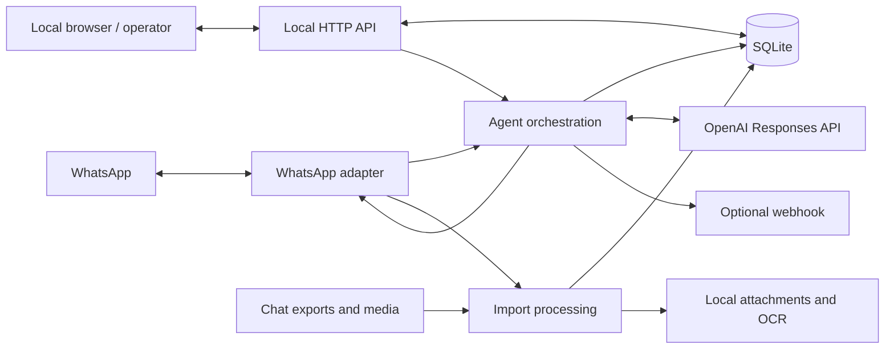

# Ditsebe: solution and architecture

Ditsebe turns residential WhatsApp conversations into a local, queryable message store. Residents can ask about recent discussions, while operators can import older conversations into a separate archive for review.

## Problem and solution

Community groups contain useful information about outages, maintenance, safety, and local recommendations, but that information is scattered through conversation history. Ditsebe links a WhatsApp account, normalizes incoming messages, and stores them in SQLite. An explicitly triggered assistant answers using recent group context. Historical imports provide a reviewable archive with local image OCR and PDF text extraction.

## Implemented capabilities

| Capability | Current behavior |
| --- | --- |
| Live capture | Captures group messages by default, retaining text, captions, sender, timestamps, reply IDs, and raw payloads. |
| Group assistant | Answers `!ditsebe` questions in one configured group using recent live messages. |
| Manual sending | Local API sends group messages, quoted replies, or private follow-ups to the author of a captured group message. |
| Archive | Imports available WhatsApp history or English Android/iOS text exports, separately from live history. |
| Extraction | Local English OCR for images and text extraction/OCR for PDFs. |
| Review | Source-linked annotations and a viewer with disposition filters. Annotation writes use the local `markArchive()` function; there is no HTTP write route. |
| Diagnostics | Structured logs, connection/LLM health, import counts, coverage, and attachment outcomes. |

The LLM cannot browse, book services, register providers, create leads, or send private messages. Manual private sending is an operator capability. Imported archives are not used as assistant context.

## Architecture

The full application runs as one Bun process with three TypeScript workspaces and a shared SQLite database.

| Workspace | Source entry points | Responsibility |
| --- | --- | --- |
| WhatsApp | [wa.ts](../packages/whatsapp/src/wa.ts), [normalize.ts](../packages/whatsapp/src/normalize.ts) | Pairing, reconnect, filtering, normalization, history requests, attachment download, and sending. |
| API | [api.ts](../packages/api/src/api.ts), [db.ts](../packages/api/src/db.ts), [archive.ts](../packages/api/src/archive.ts), [privacy.ts](../packages/api/src/privacy.ts) | Persistence, queries, archive reports, redaction, HTTP routes, and archive viewer. |
| Agent | [index.ts](../packages/agent/src/index.ts), [agent.ts](../packages/agent/src/agent.ts), [llm.ts](../packages/agent/src/llm.ts), [importer.ts](../packages/agent/src/importer.ts) | Application wiring, sinks, reply queue, model calls, and import processing. |

The agent depends on the API and WhatsApp workspaces. The API uses WhatsApp types and logging. WhatsApp does not depend on the other workspaces. API-only startup serves stored data without starting WhatsApp or the assistant.

## Storage

SQLite uses WAL mode; tables are created on startup without a versioned migration framework.

| Table | Key | Purpose |
| --- | --- | --- |
| `messages` | `(chat_id, id)` | Live fields, raw JSON, capture time. Replays update available names/text without adding duplicate rows. |
| `import_runs` | `id` | Source, group, status, timestamps, counters, and notes. |
| `archive_messages` | `(chat_id, id)` | Staged text, pseudonymous sender, raw payload, attachment path/status, and extracted text. |
| `import_items` | `(run_id, chat_id, message_id)` | Associates staged messages with import runs. |
| `archive_reviews` | `(chat_id, message_id)` | Disposition, category, topic, summary, caveat, and review timestamp. |
| `private_settings` | `key` | Persistent redaction salt for stable pseudonyms. |

Associations are maintained in application code; the schema does not declare foreign keys. Message times use epoch milliseconds. Default storage is `data/messages.db`, `data/imports/<run-id>/`, `data/ocr/`, and `.wa-auth/`. Changing `DB_PATH` does not relocate import/OCR directories.

## Reliability and limitations

- Reply jobs use a serial in-memory queue. Seen IDs and stored outgoing quote links suppress replays. A crash between sending and saving can still duplicate a reply.
- Sink failures are logged independently. Fan-out awaits all sinks, so a slow webhook can delay the assistant callback. There is no webhook timeout or durable retry queue, and database deduplication does not prevent duplicate webhook deliveries.
- Non-logout disconnections schedule reconnect after three seconds. Logout requires pairing again.
- History requests ask for up to 100 older messages per page and do not guarantee complete coverage. Only one history group is selected at a time; the latest selection is restored on startup, with no exposed switch/reset operation.
- Repeated exports are fingerprint-deduplicated. Export and WhatsApp IDs differ, so cross-source duplicates require review.
- The unauthenticated HTTP API binds to localhost. Raw data is unencrypted; redaction is best effort. Provider registration, automated service workflows, semantic retrieval, and autonomous private follow-ups are future work.

See [data flow](data-flow.md) and [operations/API reference](operations.md).
